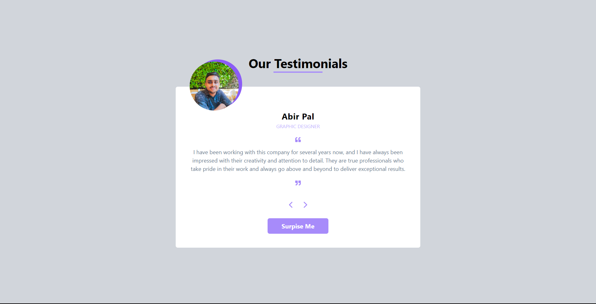

# Testimonial Project

The Testimonial Project is a versatile and dynamic web application that can be easily integrated into any website to showcase user testimonials. It features a single page with a user-friendly interface that allows users to navigate through testimonials, view random testimonials, and get insights into what others are saying about the company or organization.



## Table of Contents

- [Overview](#overview)
- [Installation](#installation)
- [Usage](#usage)
- [Features](#features)
- [Technologies Used](#technologies-used)
- [Contributing](#contributing)
- [License](#license)

## Overview

The Testimonial Project is a React-based web application that provides a dynamic platform for displaying user testimonials. Key features include:

- **Testimonial Display:** Each testimonial includes a circular picture of the person, their name, designation, and feedback/views/opinions about the company or organization.

- **Navigation:** Users can easily navigate through testimonials using navigation buttons (forward and backward) to explore more testimonials.

- **Surprise Me:** A "Surprise Me" button allows users to view a random testimonial, adding an element of excitement and discovery.

The project is designed to be easily integrated into any website, providing valuable social proof and enhancing the user experience.

## Installation

1. Clone the repository:

   ```bash
   git clone https://github.com/sargunkohli152/Testimonials_Project.git

2. Install dependencies:

   ```bash
   npm install

3. Start the application:

   ```bash
   npm run start

## Usage
To integrate the Testimonial Project into your website:

 - Copy the relevant components and styles from the project to your website's codebase.

 - Customize the testimonials, pictures, and content to match your specific needs.

 - Ensure that you have React and Tailwind CSS set up in your project for compatibility.

 - Add the navigation and "Surprise Me" button functionality to your website's UI.

## Features
 - User-friendly and dynamic testimonial display.
 - Easy navigation through testimonials (forward and backward).
 - "Surprise Me" button to display a random testimonial.
 - Versatile and easily integrable into any website.

## Technologies Used
 - React.js
 - Tailwind CSS

## Contributing
Contributions are welcome! If you have any suggestions, improvements, or want to add new features to enhance the Testimonial Project, please fork the project, make your changes, and submit a pull request.
 
## License
MIT License

Permission is hereby granted, free of charge, to any person obtaining a copy of this software and associated documentation files (the "Software"), to deal in the Software without restriction, including without limitation the rights to use, copy, modify, merge, publish, distribute, sublicense, and/or sell copies of the Software, and to permit persons to whom the Software is furnished to do so, subject to the following conditions:

The above copyright notice and this permission notice shall be included in all copies or substantial portions of the Software.

THE SOFTWARE IS PROVIDED "AS IS", WITHOUT WARRANTY OF ANY KIND, EXPRESS OR IMPLIED, INCLUDING BUT NOT LIMITED TO THE WARRANTIES OF MERCHANTABILITY, FITNESS FOR A PARTICULAR PURPOSE AND NONINFRINGEMENT. IN NO EVENT SHALL THE AUTHORS OR COPYRIGHT HOLDERS BE LIABLE FOR ANY CLAIM, DAMAGES OR OTHER LIABILITY, WHETHER IN AN ACTION OF CONTRACT, TORT OR OTHERWISE, ARISING FROM, OUT OF OR IN CONNECTION WITH THE SOFTWARE OR THE USE OR OTHER DEALINGS IN THE SOFTWARE.
